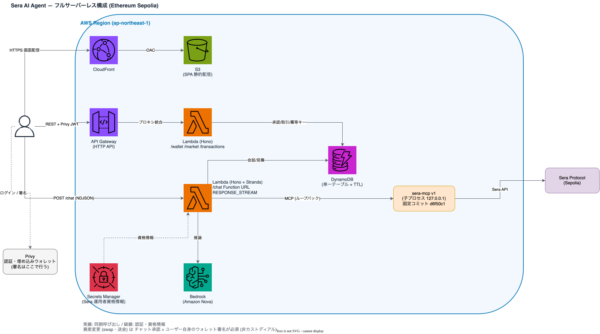

# sera-strands-agent

AWS CDK で構築する、フルサーバーレスな **Sera Protocol AI エージェント**。
チャットで自然言語から、ウォレット作成・残高確認・Sera の板/見積/履歴の取得・ステーブルコイン swap・送金・トランザクション状態確認を行う教材用サンプルです（対象ネットワークは Ethereum Sepolia テストネットのみ）。

> **重要: 検証状況について**
> このリポジトリの実装は「型チェック・ユニットテスト・CDK synth」までは確認済みですが、
> **AWS へのデプロイ、Bedrock / Privy / Sera（sera-mcp）との実接続、ブラウザ E2E は未検証**です。
> 詳細は [検証状況](#検証状況) を参照してください。未検証の項目を動作確認済みとして扱わないでください。

## 完成時にできること

| 操作 | 種別 | 実行前の確認 |
| --- | --- | --- |
| ウォレット作成（Privy 埋め込みウォレット） | 状態変更 | 画面操作 |
| 残高確認 | 読み取り | 不要 |
| 板（orderbook）・見積・履歴の取得 | 読み取り | 不要 |
| swap | **資産変更** | ネットワーク/トークン/数量/手数料/有効期限を表示 → チャット承認 → **ユーザーのウォレット署名** |
| 送金 | **資産変更** | 送信先/トークン/数量を表示 → チャット承認 → **ユーザーのウォレット署名** |
| 取引状態の確認 | 読み取り | 不要（チェーン/Sera の検証済み結果のみ反映） |

### サンプル会話（想定）

```
あなた: 残高を教えて
Bot   : 0xAbc… の Sepolia 残高です: USDC 100.0 / USDT 50.0 …
あなた: 10 USDC を USDT に swap したい
Bot   : 見積です（ネットワーク: Sepolia / 10 USDC → 約 9.99 USDT / 手数料 … / 有効期限 …）。実行しますか？
        [確認画面 → 承認 → ウォレット署名]
```

## アーキテクチャ

```
Browser (React + Vite + Privy)
   │  Privy JWT
   ├─▶ API Gateway (HTTP API) ─▶ Lambda (Hono)   /wallet /market /transactions
   └─▶ Lambda Function URL (RESPONSE_STREAM) ─▶ Lambda (Hono + Strands Agent)  /chat (NDJSON)
                                   │
                                   ├─ Bedrock (Amazon Nova)     … Strands Agents TS SDK
                                   ├─ sera-mcp (子プロセス, 127.0.0.1) … Sera Protocol
                                   ├─ DynamoDB (単一テーブル)    … 会話/見積/承認/取引/冪等キー
                                   └─ Secrets Manager           … Sera 運用者資格情報
Frontend は S3 + CloudFront（OAC）から配信
```



編集用の [`architecture.drawio`](docs/architecture/architecture.drawio)、SVG/PNG、生成元の [`build_diagram.py`](docs/architecture/build_diagram.py)（再生成: `python3 docs/architecture/build_diagram.py`）は `docs/architecture/` にあります。図は実装（CDK・バックエンド）から起こしたもので、実環境での動作を示すものではありません。

### 主要な設計判断

- **読み取りと資産変更の分離**: 資産変更は「チャット承認 + ユーザー自身のウォレット署名」の両方が必要（非カストディアル）。
- **/chat は Lambda Function URL のレスポンスストリーミング**: API Gateway の 29 秒制限を避けるため。
- **状態は検証済みの結果だけを反映**: 取引の成否は LLM の文章ではなく、Sera の決済状態/オンチェーンのレシートから更新。照会に失敗したら古い状態に `statusCheckError` を付けて返す。
- **二重実行防止**: DynamoDB の条件付き書き込みによる冪等キーを、ブロードキャスト直前に取得し、送信前の失敗時は解放。
- **送金は署名済みトランザクションを viem で検証**（トークン契約・宛先・数量・署名者）してから送信。
- **sera-mcp は git submodule（固定コミット `d6f50c1`）**: npm 未公開のため。`pnpm build:sera-mcp` で単一ファイルにバンドルし Lambda に同梱。sera-mcp v2 も確認したが、サーバー保持鍵/stdio のみ/LICENSE なしのため v1 を採用（`specs/001-sera-protocol-chatbot/research.md` §9）。

## ディレクトリ構成

```
apps/
  backend/    Hono + Strands Agent（Lambda）。src/{agent,routes,store,auth}
  frontend/   React 19 + Vite + Privy
  cdk/        CDK（DataStack / BackendStack / FrontendStack）
packages/
  api-spec/   OpenAPI 正本(openapi.yaml)・生成型・Postman コレクション
  shared/     共有型
scripts/      build-sera-mcp.mjs, stack.mjs（デプロイ/削除）
vendor/sera-mcp  git submodule（固定コミット）
specs/001-sera-protocol-chatbot/  Spec Kit 成果物（仕様・計画・タスク・調査）
docs/         設計メモ、アーキテクチャ図、ブログ原稿
```

## 前提条件

- Node.js 22 以上、pnpm 11.24.0（`packageManager` で固定）
- AWS アカウントと認証済みの AWS CLI（デプロイ時のみ）。Bedrock で使用するモデルへのアクセス有効化
- [Privy](https://privy.io) のアプリ（App ID と検証キー）
- Sepolia の RPC URL
- Sera の運用者資格情報（API キー/シークレット）※ 取得方法は sera-mcp 側のドキュメントを参照
- Sepolia のテストトークン（残高が不足している場合、アプリは faucet の案内を表示します）

## セットアップ

```bash
git clone --recurse-submodules <このリポジトリ>
cd sera-strands-agent
pnpm install
pnpm build:sera-mcp        # vendor/sera-mcp をバンドル → apps/backend/vendor-dist/sera-mcp.mjs
```

## 環境変数

| 変数 | 使う場所 | 説明 |
| --- | --- | --- |
| `VITE_PRIVY_APP_ID` | frontend（ビルド時） | Privy App ID |
| `VITE_API_URL` | frontend（ビルド時） | API Gateway の URL（`pnpm stack:deploy` が自動設定） |
| `VITE_CHAT_URL` | frontend（ビルド時） | Function URL（同上） |
| `PRIVY_APP_ID`, `PRIVY_VERIFICATION_KEY` | backend（デプロイ時に環境から引き継ぎ） | JWT 検証 |
| `SEPOLIA_RPC_URL` | backend | 送金トランザクションの検証・レシート確認 |
| `BEDROCK_MODEL_ID`, `BEDROCK_REGION` | backend | Bedrock のモデル/リージョン。既定は Amazon Nova 2 Lite（`jp.amazon.nova-2-lite-v1:0`, `ap-northeast-1`）。他モデルに変える場合は CDK の IAM 許可も要変更 |
| `POLICY_DRY_RUN` | backend | sera-mcp のドライラン |
| `TABLE_NAME`, `SERA_NETWORK`, `SERA_MCP_BIN`, `SERA_SECRET_ID` | backend | CDK が自動設定 |

秘密情報（Sera の API キー/シークレット）は **環境変数・コード・テンプレートに書きません**。スタックが作る Secrets Manager の空シークレットに、デプロイ後にご自身で設定します（[デプロイ](#デプロイ動作確認削除)）。

## API 仕様とコード生成

正本は `packages/api-spec/openapi.yaml`。

```bash
pnpm --filter api-spec run generate         # 型を生成 → packages/api-spec/generated/types.ts
pnpm --filter api-spec run generate:check   # 生成物がコミット済みと一致するか（CI で実行）
pnpm --filter api-spec run postman:generate # Postman コレクションを再生成
```

フロントエンドは `openapi-fetch` + 生成型で呼び出します（Java 製の OpenAPI Generator ではなく `openapi-typescript` を採用。理由は `research.md`）。

## テスト

```bash
pnpm --filter backend test     # vitest（41 件）
pnpm --filter cdk test         # jest（8 件、CloudFormation アサーション）
pnpm --filter frontend lint
pnpm --filter frontend build   # tsc -b && vite build（型チェック含む）
pnpm exec biome check .
```

API の疎通テスト（デプロイ後）:

```bash
# packages/api-spec/postman/environment.template.json をコピーして
# environment.local.json（gitignore 済み）を作り、baseUrl と bearerToken を設定
pnpm --filter api-spec run test:api
```

## デプロイ・動作確認・削除

> **注意**: 実際に AWS リソースを作成し、料金が発生します。ステージ名は必須です。

```bash
export VITE_PRIVY_APP_ID=... PRIVY_APP_ID=... PRIVY_VERIFICATION_KEY=... SEPOLIA_RPC_URL=...
pnpm stack:deploy -- --stage dev
```

`stack:deploy` は「型生成 → sera-mcp バンドル → Data/Backend デプロイ → Backend の URL を使って frontend をビルド → Frontend デプロイ」を順に行い、最後に URL を表示します（`pnpm deploy` は pnpm 組み込みコマンドと衝突するため `stack:*` という名前です）。

デプロイ後、Sera の資格情報を設定します（値は端末に直接入力し、チャットやコードに貼らないでください）:

```bash
aws secretsmanager put-secret-value --secret-id <SeraSecretArn> \
  --secret-string '{"apiKey":"...","apiSecret":"..."}'
```

バックエンドは初回の sera-mcp 起動時に `SERA_SECRET_ID` からこの値を読み出し、子プロセスの環境変数（`SERA_API_KEY` / `SERA_API_SECRET`）としてのみ渡します（`apps/backend/src/agent/sera-auth.ts`、ユニットテスト済み。実 AWS での動作は未検証）。空のままなら「未設定」として扱い、資格情報が必要なツールだけが失敗します。設定後は Lambda の実行環境が入れ替わるまで古い値が使われるため、反映が必要なら関数を再デプロイしてください。

削除:

```bash
pnpm stack:destroy -- --stage dev
```

## 検証状況

| 項目 | 状態 | 根拠 |
| --- | --- | --- |
| backend ユニットテスト 41 件 | ✅ 通過 | 実行確認 |
| CDK アサーション 8 件 / synth | ✅ 通過 | 実行確認 |
| backend/cdk `tsc --noEmit`、frontend build/oxlint、生成コード差分なし | ✅ 通過 | 実行確認 |
| sera-mcp のバンドルが Lambda アセットに含まれる | ✅ | `cdk.out` を確認 |
| sera-mcp バンドルの実起動 | ❌ 未検証 | |
| AWS へのデプロイ | ❌ 未実施 | |
| Bedrock 呼び出し・ストリーミング | ❌ 未検証 | |
| Privy ログイン/署名（`useSignTypedData` 等） | ❌ 未検証 | |
| Sera 応答の形（`get_coin_metadata`、`fee_breakdown`、決済状態の語彙など） | ❌ 実機未確認（ソースからの推定） | |
| ブラウザ E2E、Newman 実行 | ❌ 未実施 | |
| SC-001 / SC-002 の計測 | ❌ 未計測 | |

## 制約・未対応事項

- Sera 資格情報のローダーは実装済みだが、実際の Secrets Manager / sera-mcp との結合は未検証。
- EIP-2612 permit が必要な見積は未対応（`PERMIT_NOT_SUPPORTED` で拒否）。
- 実行環境はサーバー側の運用者資格情報に依存する Sera ツールが多い。
- Sepolia のみ。メインネットでの利用は想定していません。
- 料金: Lambda / API Gateway / DynamoDB / S3 / CloudFront / Secrets Manager / Bedrock（トークン従量）が発生します。**実測前のため概算額は記載しません**。

## トラブルシューティング

- `sera-mcpのバンドルがありません` → `git submodule update --init && pnpm build:sera-mcp`
- `vendor/sera-mcp が固定コミットではありません` → `git submodule update --init`
- `npx cdk` が動かない → `apps/cdk/node_modules/.bin/cdk` を使う（`pnpm cdk` 経由）
- ビルドスクリプトが無視される（pnpm）→ `pnpm-workspace.yaml` の `allowBuilds` を確認

## 参照元・ライセンス

- Sera Protocol / [sera-cx/sera-mcp](https://github.com/sera-cx/sera-mcp)（MIT, 固定コミット d6f50c1）
- [Strands Agents TypeScript SDK](https://github.com/strands-agents/sdk-typescript)、Hono、Privy、AWS CDK
- 仕様・計画・調査の詳細: `specs/001-sera-protocol-chatbot/`
- 本リポジトリ: MIT
